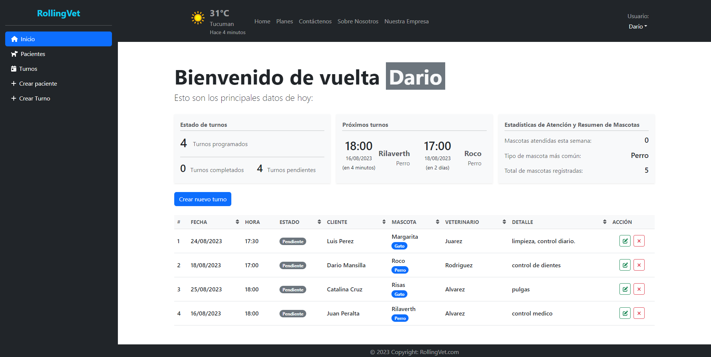

# RollingVet - Proyecto final del curso FullStack - RollingCode




[Link deploy](https://rolling-vet23.netlify.app/)

[Link tablero Trello](https://trello.com/b/6trD7CYg/grupo-1-proyecto-final-rc)

Se trata de un proyecto compuesto por la parte de front-end, backend y base de datos. En este repositorio solo se encuentra la parte del front-end, el backend esta en el repositorio del link.

- [backend-repositorio](https://github.com/msdario12/backend-grupo-01-proyecto-final-rc)

Se siguieron unos requerimientos dados y se práctico todo lo aprendido en el curso mas investigación por cuenta propia.

## Usuarios con permisos de administrador

```
user: dario@admin.com
password: adminadmin

user: matias@admin.com
password: adminadmin

user: melany@admin.com
password: adminadmin
```

## Descripción

La aplicación se basa en una home page donde se muestra información de un sitio para una veterinaria, junto con el personal que trabaja ahí, servicios que se ofrecen, algunos productos que se pueden adquirir en la veterinaria, planes del tipo obra social para las mascotas y testimonios de clientes.

Además tambien se tiene una pagina de Sobre Nosotros, donde tenemos informacion de los integrantes del grupo, una pagina de contacto donde se pueden enviar mensajes de consulta, una pagina donde mostramos información respecto a la historia y ubicación de la veterinaria, una pagina donde se puede reservar un turno y el login para administradores.

En conjunto a esto, el usuario admin tiene acceso mediante un correo y contraseña a un dashboard para la gestion de turnos y pacientes, el mismo puede realizar las operaciones de Crear, Editar, Remover y Leer los mismos. Además tambien se muestra una información general de los datos actuales en la base de datos.

## Caracteristicas generales

- Validación de todos los inputs usando yup y formik.
- Feedback de cada input en concordancia con la validación de cada input.
- Función de notificación tipo toast, que muestra la respuesta del backend en cuanto a si una operación se realizo de forma correcta o no.
- Conexión con el backend mediante socket-io, la misma es para mostrar una notificación cuando un turno recién creado con estado de "Pendiente" cambie de estado automáticamente a "Esperando paciente" cuando se cumpla la fecha de dicho turno.

* Botón de submit de cada formulario tiene un estado de cargando con un spinner, hasta que el servidor responde, asi como también tiene un estado de deshabilitado.
* Se usaron loaders del tipo spinner para la espera de las peticiones de datos en las distintas vistas.

- Mensajes de errores en el backend en caso de no cumplir con una validacion del lado del servidor.

## Dashboard

### Pantalla de bienvenida

En la misma podemos ver un resumen de la cantidad total de turnos, los turnos completados, pendientes, y los 2 turnos más próximos. Asi como también la cantidad de mascotas atendidas en la semana, el tipo de especie mas comun registrado y la cantidad total de mascota.

Abajo tenemos la tabla donde se muestran los turnos, tambien se pueden editar, eliminar y agregar.

### Pantalla de pacientes

En esta tenemos una tabla donde aparece la informacion sobre los pacientes registrados. Por cada fila tenemos alguna información del dueño y de la mascota en si.

#### Edición de pacientes

Podemos acceder a la edición del mismo con el boton verde de cada fila, el mismo abre un modal con un formulario con validación y nos permite editar ya sea datos del dueño o de la mascota en si.

#### Agregar paciente

También podemos agregar un paciente nuevo mediante el boton de "Crear nuevo paciente", en este tenemos la particularidad que el input de "email" al escribir 3 caracteres va a realizar una consulta a la db trayendo los emails que puedan coincidir con el que se ingresa, en caso de que se encuentren resultados, los inputs referidos al dueño se ponen en deshabilitado esperando que se seleccione uno de los resultados de la lista desplegable. Entonces es una validacion para no crear un email repetido que ya este almacenado en la db, al seleccionar uno de los emails se cargaran los datos de ese usuario en los inputs correspondiente pero no se permitira la edicion de estos en esta vista.

En caso de que no se encuentre algun resultado, quiere decir que no se registro ese usuario y permite habilitar los inputs de usuario para agregar al nuevo paciente, con las validaciones correspondientes.

Para el caso de los datos de mascotas simplemente se validan los datos y al estar todo ok, se habilita el boton de Crear Paciente.

#### Eliminar paciente

El botón de eliminar paciente abre un modal donde se muestra los datos del paciente seleccionado asi como los turnos que ya tiene asignados. Al confirmar esto se estarán borrando también los turnos asignados a este paciente.

#### Detalle de un paciente

Al hacer click en cualquier fila de un paciente se abre una pagina en la que tenemos detalles de ese paciente y tambien la tabla de turnos asociados a ese paciente, de la misma forma tambien podemos crear un turno a este paciente, al hacer click en el boton se cargan los datos del paciente de la pantalla de detalle y solo resta introducir los valores propios del turno.

### Pantalla de turnos

Acá se pueden ver el listado de turnos cargados, se toma por defecto una duración de 30 minutos por turno, el mismo se podria modificar para poder establecer un tiempo variable de turno cuando se lo este creando, pero en esta version esta establecido en este valor.

#### Agregar un turno

Al hacer click en agregar un turno tenemos un modal donde podemos buscar un paciente previamente creado introduciendo el email, el nombre o el nombre de la mascota, de esta forma hacemos una consulta a la db para traer los resultados, en caso de existir resultados y hacer click en uno de estos se van a cargar los datos de este paciente (del dueño y la mascota), y más abajo se habilitan los inputs propios del turno, que son el veterinario con quien atenderse, la fecha y hora del turno y detalles del turno

La selección de la fecha y hora del turno se hace mediante la libreria de [react-datepicker](https://www.npmjs.com/package/react-datepicker) , la cual tiene una validacion en la que se verifica que la fecha no sea una anterior a la actual, y ademas que no sea un fin de semana y el horario solo en el que esta abierto la veterinaria.

En caso de querer crear un turno nuevo a un paciente que no existe (no se encuentran resultados), se habilita un boton que redirige a la pantalla de creacion de pacientes. El dato interesante es que usando una caracteristica de react-router, al terminar el registro correcto del paciente en esta pagina, se realiza una redireccion automatica a la misma pagina de creacion de turnos pero traemos esa informacion del nuevo paciente creado (se pasa la informacion por medio de los states del custom hook de location), entonces ya solo resta definir los valores del turno en si.

#### Edición de turnos

Permite el cambio de los inputs del turno, tambien se validan todos los inputs.

#### Eliminar un turno

Permite eliminar un turno, al hacer esto tambien se lo elimina del paciente al cual este asociado.

### Dependencias

        "@emailjs/browser": "^3.11.0",
    	"@fortawesome/fontawesome-svg-core": "^6.4.2",
    	"@fortawesome/free-brands-svg-icons": "^6.4.2",
    	"@fortawesome/free-regular-svg-icons": "^6.4.0",
    	"@fortawesome/free-solid-svg-icons": "^6.4.0",
    	"@fortawesome/react-fontawesome": "^0.2.0",
    	"axios": "^1.4.0",
    	"bootstrap": "^5.3.0",
    	"date-fns": "^2.30.0",
    	"formik": "^2.4.2",
    	"react": "^18.2.0",
    	"react-bootstrap": "^2.8.0",
    	"react-datepicker": "^4.16.0",
    	"react-dom": "^18.2.0",
    	"react-router-dom": "^6.14.2",
    	"socket.io-client": "^4.7.2",
    	"sweetalert2": "^11.7.18",
    	"yup": "^1.2.0"

### Ejecutar el programa

```
npm run dev
```

## Autores

- [Dario Mansilla](www.linkedin.com/in/msdario12)
- Matias Homet
- Melany Rodriguez
